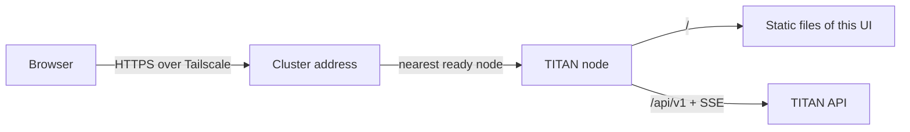

# TITAN Web

**The Web UI for [TITAN](https://github.com/vlukyanets/titan), a self-hosted AI assistant, planner and tracker for your household.**


Chat with your assistant, see today's plan, and manage tasks, the calendar,
notes and trackers from any browser on your tailnet. The owner also manages the
household here: members, devices, autonomy policy, usage and budgets. Every
TITAN node serves the UI itself, and all nodes share one
[Tailscale](https://tailscale.com) address, so there is nothing extra to host
and nothing to pair: open the cluster address, sign in once with your username
and password, and keep working when a node goes down.

> **Status:** pre-alpha. The app skeleton runs: navigation, themes, three
> languages and the offline indicator, with every screen still a stub. Sign-in
> and chat come next. See the [Web UI spec](docs/spec/web.md) and the
> [roadmap](docs/roadmap/milestones.md).

## Features (v1 target)

- **Chat** with streamed answers and inline Approve and Reject buttons.
- **Today** view: events, time blocks, due tasks and habit check-ins together.
- **Tasks, calendar, notes and trackers**, with room for wide screens: week
  views, tables and charts.
- **Household settings** for the owner: members, devices, autonomy policy,
  usage and monthly budgets.
- **Calm offline behaviour**: when the node is unreachable, content stays on
  screen and a small offline badge appears. No blocking spinners.
- Light and dark themes, desktop and mobile widths.

## How it fits together



The browser loads the UI and calls the API from the same address, so there is
no CORS and no second port. See the [architecture](docs/architecture/overview.md).

## Requirements

- A running TITAN backend ([titan](https://github.com/vlukyanets/titan)).
- Tailscale on the computer or phone, signed in to the same tailnet.
- A current Firefox, Chrome or Safari.

## Development

You need Node 24 (22.12 or newer works) with Corepack, which provides the
pinned pnpm.

```bash
corepack enable
pnpm install          # also generates the API types
pnpm dev              # http://localhost:5173, /api proxied to TITAN_API_URL
pnpm typecheck && pnpm lint && pnpm test
pnpm build            # static files in dist/
pnpm e2e              # after pnpm build and pnpm exec playwright install
```

The development server forwards `/api` to a TITAN node, by default
`http://127.0.0.1:8000`; set `TITAN_API_URL` to use another one. Releases are
`titan-web-<version>.tar.gz` archives that a TITAN node serves; see
[build and release](docs/architecture/overview.md#build-and-release).

## Repositories

| Repository | Contents |
|---|---|
| [titan](https://github.com/vlukyanets/titan) | Backend, agent runtime, CLI, product spec |
| [titan-android](https://github.com/vlukyanets/titan-android) | Android app |
| [titan-web](https://github.com/vlukyanets/titan-web) | Web UI (this repo) |

## Documentation

- [Documentation index](docs/README.md)
- [Web UI spec](docs/spec/web.md) and the
  [product spec](https://github.com/vlukyanets/titan/blob/master/docs/spec/product.md)
- [Architecture](docs/architecture/overview.md)
- [Decisions (ADRs)](docs/adr/)
- [Roadmap](docs/roadmap/README.md)

## Contributing

Read [CONTRIBUTING](docs/CONTRIBUTING.md) for the commit and pull request rules.
AI agents also follow [CLAUDE.md](CLAUDE.md).

## License

Released into the public domain under the [Unlicense](LICENSE).
