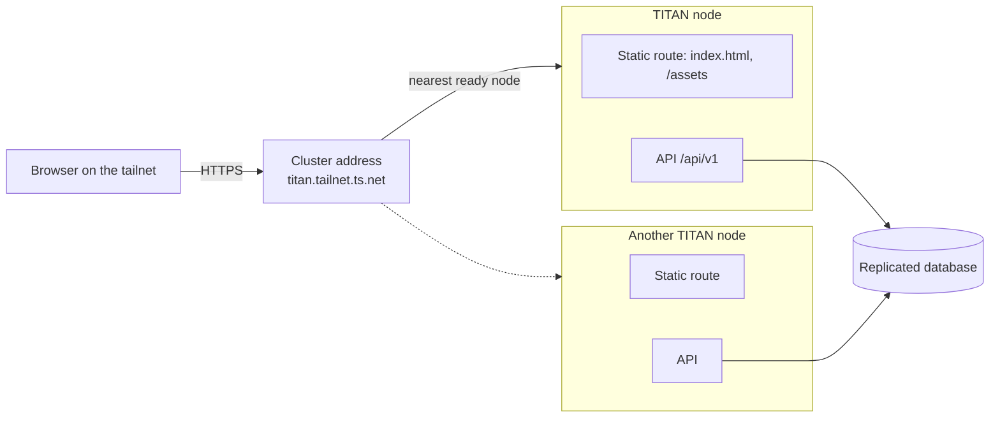

# Architecture overview

Status: **Draft**. This is the target architecture for the v1 UI.

## Deployment



- The node serves the built UI and the API on one origin
  ([ADR 0002](../adr/0002-served-by-the-node.md)). The UI never calls another
  host.
- That origin is the cluster address, a Tailscale Service that every ready
  node advertises
  ([titan ADR 0013](https://github.com/vlukyanets/titan/blob/master/docs/adr/0013-one-cluster-address.md)).
  Failover is Tailscale's job; the UI has no node list.
- The UI is a static single-page app. Deep links work because the node answers
  `index.html` for every path outside `/api/` and `/assets/`.
- A titan release pins the UI release it serves, so the UI and the API always
  come from matching versions.

## Stack

| Concern | Choice |
|---|---|
| Language | TypeScript, strict mode |
| Framework | React with Vite ([ADR 0004](../adr/0004-frontend-framework.md)) |
| Routing and server data | TanStack Router, TanStack Query |
| Components and styling | shadcn/ui on Radix primitives, Tailwind CSS |
| Forms | React Hook Form with Zod |
| Calendar, tables, charts | FullCalendar, TanStack Table, Recharts |
| API client | Types generated with `openapi-typescript`, calls through `openapi-fetch` ([ADR 0003](../adr/0003-openapi-generated-client.md)) |
| Streaming | `fetch` with a hand-written `text/event-stream` reader |
| Authentication | `HttpOnly` session cookie set by the node ([titan ADR 0012](https://github.com/vlukyanets/titan/blob/master/docs/adr/0012-browser-sessions-for-the-web-ui.md)) |
| Translations | FormatJS (`react-intl`), ICU message format, one file per language |
| Tests | Vitest with Testing Library, Playwright end to end |
| CI | GitHub Actions workflow `CI TITAN Web`: type check, lint, unit tests, build, release archive |

## Layout

The folder names below are the plan.

```text
openapi/             copy of the backend's openapi.json
src/app/             entry point, router, layout, theme, providers
src/shared/api/      generated types, client, stream reader, session handling
src/shared/ui/       shared components, offline indicator
src/shared/i18n/     translation layer and message files
src/features/today/
src/features/chat/
src/features/tasks/
src/features/calendar/
src/features/notes/
src/features/trackers/
src/features/reminders/
src/features/notifications/
src/features/activity/
src/features/settings/
src/features/household/
```

Feature folders depend on `src/shared/*`, never on each other.

## Data flow

- Server data is cached per query in memory. A failed refresh **keeps the
  previous data** and only updates connection or error flags, which implements
  the "content stays visible" rule without any storage in the browser.
- A shared connection state combines failed requests, a light health check
  against `/api/v1/health` while requests fail, and the browser's online and
  offline events. The layout shows the offline indicator from it.
- Loading indicators are local to the component that loads. A full-page
  spinner is allowed only for the very first load of the app.
- A `401` from any request clears the cached data and opens the sign-in page,
  keeping the current address to return to. Within a minute of signing in, a
  `401` is first retried once after two seconds, in case the request reached a
  node before the new session did.
- A `403` asking for a recent sign-in opens a password prompt and repeats the
  request after it.

## Chat streaming

- Sending a message is a `POST` whose answer is `text/event-stream`: `turn`,
  then `text`, `tool` and `approval` events, then `done` or `error`
  ([API contract](https://github.com/vlukyanets/titan/blob/master/docs/api/README.md)).
- The `done` event carries the stored reply, which replaces the streamed text.
- If the stream breaks, the UI shows the partial text, marks the connection as
  offline, and reloads the thread when the node answers again; the node keeps
  writing the reply meanwhile.

## Security

- The session token is never visible to JavaScript. Requests rely on the
  cookie, and every request that changes data also sends the header the node
  requires against cross-site requests.
- The UI loads nothing from other hosts and runs under the node's strict
  `Content-Security-Policy` with Trusted Types, so no inline or foreign script
  runs and no HTML string reaches the DOM unsanitised.
- Text from the server, including the agent's Markdown, is rendered through a
  sanitising renderer. Raw HTML from the server is never inserted.
