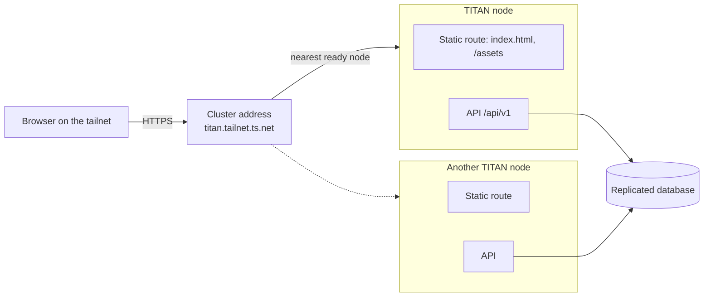

# Architecture overview

Status: **Draft**. This is the target architecture for the v1 UI.

## Deployment



- The node serves the built UI and the API on one origin
  ([ADR 0002](../adr/0002-served-by-the-node.md)). The UI never calls another
  host.
- That origin is the cluster address, a Tailscale Service that every ready
  node advertises
  ([titan ADR 0013](https://github.com/vlukyanets/titan/blob/master/docs/adr/0013-one-cluster-address.md)).
  Failover is Tailscale's job; the UI has no node list.
- The UI is a static single-page app. Deep links work because the node answers
  `index.html` for every path outside `/api/` and `/assets/`.
- A titan release pins the UI release it serves, so the UI and the API always
  come from matching versions.

## Stack

| Concern | Choice |
|---|---|
| Language | TypeScript, strict mode |
| Framework | React with Vite ([ADR 0004](../adr/0004-frontend-framework.md)) |
| Routing and server data | TanStack Router, TanStack Query |
| Components and styling | shadcn/ui on Radix primitives, Tailwind CSS |
| Forms | React Hook Form with Zod |
| Calendar, tables, charts | FullCalendar, TanStack Table, Recharts |
| API client | Types generated with `openapi-typescript`, calls through `openapi-fetch` ([ADR 0003](../adr/0003-openapi-generated-client.md)) |
| Streaming | `fetch` with a hand-written `text/event-stream` reader |
| Authentication | `HttpOnly` session cookie set by the node ([titan ADR 0012](https://github.com/vlukyanets/titan/blob/master/docs/adr/0012-browser-sessions-for-the-web-ui.md)) |
| Translations | FormatJS (`react-intl`), ICU message format, one file per language |
| Tests | Vitest with Testing Library, Playwright end to end |
| CI | GitHub Actions workflow `CI TITAN Web`: type check, lint, unit tests, build, release archive |

TypeScript stays on 5.9 while `typescript-eslint` and `openapi-typescript` do
not support TypeScript 7; the manifest's version range says so.

## Layout

```text
openapi/             copy of the backend's openapi.json
e2e/                 Playwright tests against the production build
scripts/             release archive
src/main.tsx         entry point: theme, connection state, language, render
src/app/             router, layout, navigation, query client, styles
src/shared/api/      generated types, client, connection state
src/shared/ui/       shared components, theme, offline indicator
src/shared/i18n/     translation layer and message files
src/shared/lib/      small helpers
src/features/today/
src/features/chat/
src/features/tasks/
src/features/calendar/
src/features/notes/
src/features/trackers/
src/features/reminders/
src/features/notifications/
src/features/activity/
src/features/settings/
src/features/household/
```

Feature folders depend on `src/shared/*`, never on each other, and
`src/shared` depends on neither features nor `src/app`. ESLint enforces this:
imports that leave a folder go through the `@/` alias, so the rule can check
them by name. Routes are declared in code in `src/app/router.tsx`, one per
screen, and point at the screen component each feature exports.

## Data flow

- Server data is cached per query in memory. A failed refresh **keeps the
  previous data** and only updates connection or error flags, which implements
  the "content stays visible" rule without any storage in the browser.
- A shared connection state combines failed requests, a light health check
  against `/api/v1/health` while requests fail, and the browser's online and
  offline events. The layout shows the offline indicator from it.
  - The API client reports every answer to it. A network error, or a `502`,
    `503` or `504` without a TITAN problem body (so from whatever stands in
    front of the node), marks the node unreachable; any other answer marks it
    reachable. Cancelled requests count as neither.
  - While unreachable, it checks the health endpoint after 2 seconds and then
    with a doubling delay of up to 30 seconds. The browser's `offline` event
    marks the node unreachable at once, and its `online` event starts a check
    right away.
  - TanStack Query follows this state instead of the browser's: queries
    pause while the node is unreachable and refetch when it is back.
    Mutations run regardless and fail at once, so nothing is queued.
- Loading indicators are local to the component that loads. A full-page
  spinner is allowed only for the very first load of the app.
- A `401` from any request clears the cached data and opens the sign-in page,
  keeping the current address to return to. Within a minute of signing in, a
  `401` is first retried once after two seconds, in case the request reached a
  node before the new session did.
- A `403` asking for a recent sign-in opens a password prompt and repeats the
  request after it.

## Chat streaming

- Sending a message is a `POST` whose answer is `text/event-stream`: `turn`,
  then `text`, `tool` and `approval` events, then `done` or `error`
  ([API contract](https://github.com/vlukyanets/titan/blob/master/docs/api/README.md)).
- The `done` event carries the stored reply, which replaces the streamed text.
- If the stream breaks, the UI shows the partial text, marks the connection as
  offline, and reloads the thread when the node answers again; the node keeps
  writing the reply meanwhile.

## Themes and translations

- The light and dark themes are CSS variables named as in shadcn/ui. Dark
  applies when the system prefers it, unless the user chose a theme by hand;
  that choice is kept in `localStorage` and set as `data-theme` on `<html>`
  before the first render.
- Each language is one JSON file of ICU messages in
  `src/shared/i18n/messages/`. The app finds the files at build time, loads
  only the chosen language, and fills gaps from English. Message ids are
  typed from `en.json`, and a unit test keeps the ids and arguments of every
  file in step with it. Lint rejects literal text in JSX and in user-facing
  attributes such as `aria-label`.

## Build and release

- `pnpm build` writes static files to `dist/`: `index.html` and hashed files
  under `assets/`, which the node serves as ADR 0002 describes. Assets are
  never inlined as `data:` URLs, because the node's CSP does not allow them.
- `pnpm release:archive` packs `dist/` into `titan-web-<version>.tar.gz`
  with the files at the archive's root, sorted, with fixed times and owners,
  and writes `titan-web-<version>.tar.gz.sha256`. The same commit gives the
  same hash, which titan's image build pins.
- CI builds the archive on every run. Pushing the tag `v<version>`, matching
  `package.json`, publishes the archive and its hash as a GitHub release.
- The Playwright tests run the production build under the node's headers
  (`security-headers.ts`) in Chromium, Firefox and WebKit at desktop and
  phone widths, and fail on any CSP or Trusted Types violation.

## Security

- The session token is never visible to JavaScript. Requests rely on the
  cookie, and every request that changes data also sends the header the node
  requires against cross-site requests.
- The UI loads nothing from other hosts and runs under the node's strict
  `Content-Security-Policy` with Trusted Types, so no inline or foreign script
  runs and no HTML string reaches the DOM unsanitised.
- Text from the server, including the agent's Markdown, is rendered through a
  sanitising renderer. Raw HTML from the server is never inserted: lint
  rejects `dangerouslySetInnerHTML`, `innerHTML`, `outerHTML`,
  `insertAdjacentHTML` and `document.write`.
- Every request carries `X-Titan-Request: 1`, which the node requires on
  cookie-authenticated writes.
